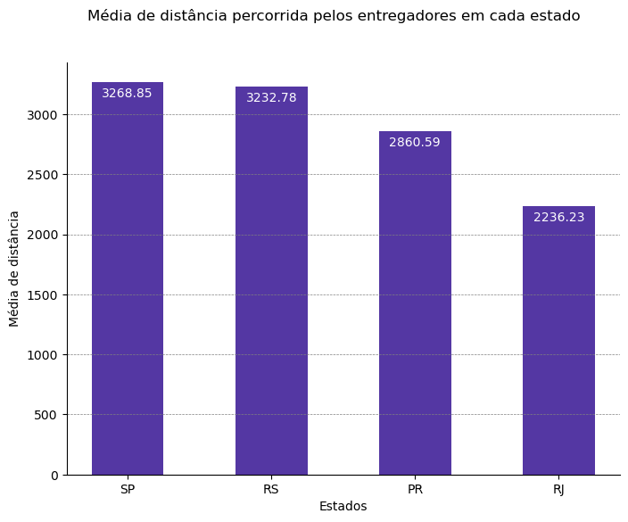
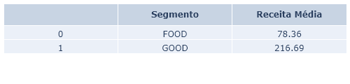
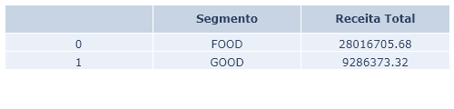
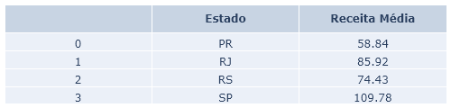

# Auxiliando os Times de Marketing e Pricing da Empresa de Delivery

No seguinte projeto, trabalhamos em uma empresa de delivery, em um time de dados centralizado que atende a diversas áreas e recebemos algumas demandas que serão respondidas por meio da Análise dos dados.

## Fonte dos dados

Kaggle: [Acesse os dados aqui](https://www.kaggle.com/datasets/nosbielcs/brazilian-delivery-center).

### Instruções para Execução
1. Baixe os dados: Clique em Download no link acima para baixar os arquivos necessários.
2. Organize os arquivos: Coloque os arquivos .csv dentro da pasta data do projeto.

Após isso, o script estará pronto para ser executado.

## Principais tecnologias usadas

## Destaques do projeto

### Solução do primeiro problema
Imagens dos Dataframes que representam os 20 entregadores que possuem maior distância percorrida ao todo, separado por tipo de profissional e meio de transporte (apenas moto).

---

### Solução do segundo problema
Distância média percorrida pelos entregadores separada por cada estado.

---

### Solução do terceiro problema
Levantamento da receita média e total separada por tipo (Food x Good), a receita média e total por estado.

